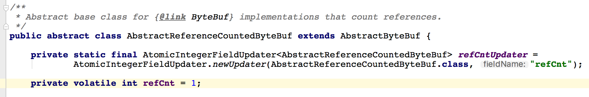

## AtomicIntegerFieldUpdater分析

AtomicIntegerFieldUpdater是一个基于反射的用于原子更新被volatile修饰的int类型的变量。

* 变量是volatile的
* 变量是int的

只有调用compareAndSet和set才能保证是原子操作。其他操作如直接对变量进行操作并不能保证是原子的。

### volatile类型的变量含义

1. 防止指令重排序。
2. 保证多线程之间内存的可见性。
3. 变量不能是static的，必须是实例变量。因为Unsafe.objectFieldOffset()方法不支持静态变量(CAS操作本质上是通过对象实例的偏移量来直接进行赋值的)。
4. 更新器只能修改它可见范围内的变量，因为更新器是通过反射来得到这个变量的，如果不可见就会报错。

如果要更新的变量是包装类型，那么可以使用AtomicReferenceFieldUpdater来进行更新。

