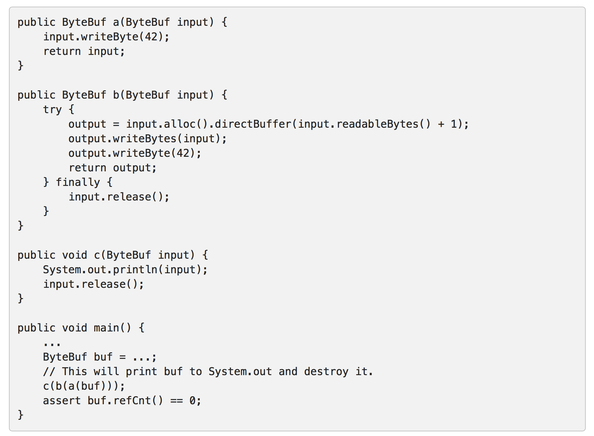
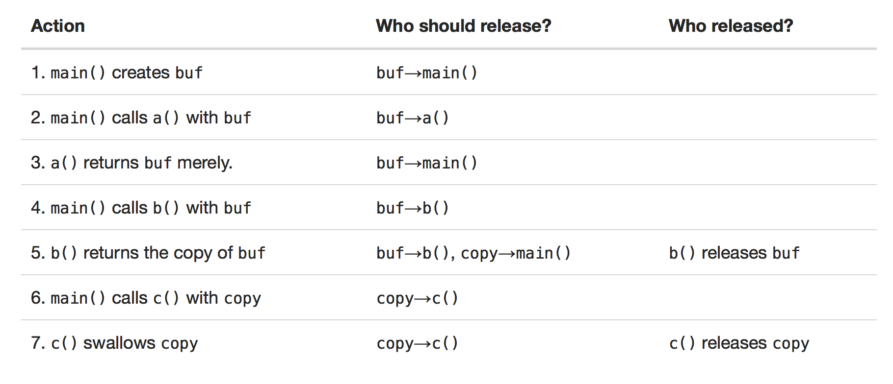

## Reference counted objects引用计数

从netty4开始某些对象的生命周期是由引用计数来管理的，这样netty就在对象不使用时可以将其放回对象池里面。

基于引用计数的对象的初始引用计数是1.

当你释放引用计数对象时，引用计数值会减1，当引用计数为0时，对象将被回收或者放回对象池中。

尝试访问一个引用计数为0的对象将抛出IllegalReferenceCountExeception。

引用计数可以通过retain()操作来增加只要对象没有被销毁。

### 谁来销毁引用计数对象？

最后去访问引用计数对象的一方来销毁引用计数对象。

1. 如果一个发送方传递了一个引用计数对象到一个接收方，发送方不需要销毁对象，而是由接收方来销毁。

2. 如果一个组件消费了一个引用计数对象并且知道不会有其他对象访问它（即没有将引用计数对象传递给其他组件），则当前对象应该负责销毁它。


### 如何判断谁去销毁引用计数对象






### Derived buffers 衍生buffer
ByteBuf.duplicate(), ByteBuf.slice() 及 ByteBuf.order(ByteOrder) 会创建一个衍生的buffer，衍生的buffer会和父buffer共享同一个引用计数
（创建衍生buffer并不会增加引用计数）。

当你传递一个衍生buffer给其他组件的时候你需要调用retain()方法。

ByteBuf.copy() 和 ByteBuf.readBytes(int) 并不会创建衍生的buffer，而是创建一个全新的buffer相当于深拷贝，具有自己独立的引用计数。


## Reference-counting in ChannelHandler

### Inbound messages 入栈信息

情况一：ByteBuf没有传递给其他Handler时用完需要释放。

```
public void channelRead(ChannelHandlerContext ctx, Object msg) {
    ByteBuf buf = (ByteBuf) msg;
    try {
        ...
    } finally {
        buf.release();
    }
}
```


情况二：ByteBuf传递给下一个Handler时不需要释放
```
public void channelRead(ChannelHandlerContext ctx, Object msg) {
    ByteBuf buf = (ByteBuf) msg;
    ...
    ctx.fireChannelRead(buf);
}
```


如果你怀疑或者只想简单的释放消息，你可以调用ReferenceCountUtil.release()方法。

```
public void channelRead(ChannelHandlerContext ctx, Object msg) {
    try {
        ...
    } finally {
        ReferenceCountUtil.release(msg);
    }
}
```


### 参考文献
[Reference counted objects](http://netty.io/wiki/reference-counted-objects.html)