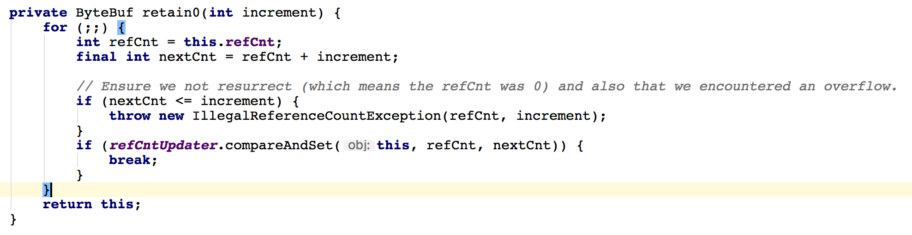

##Netty笔记

自旋锁：就是一个死循环

### AtomicIntegerFieldUpdater要点总结
1. 更新器更新的必须是int类型的变量，不能是其包装类型。
2. 更新器更新的必须是volatile类型的变量，确保线程之间共享变量时立即可见性。

### volatile类型的变量含义

1. 防止指令重排序。
2. 保证多线程之间内存的可见性。
3. 变量不能是static的，必须是实例变量。因为Unsafe.objectFieldOffset()方法不支持静态变量(CAS操作本质上是通过对象实例的偏移量来直接进行赋值的)。
4. 更新器只能修改它可见范围内的变量，因为更新器是通过反射来得到这个变量的，如果不可见就会报错。

如果要更新的变量是包装类型，那么可以使用AtomicReferenceFieldUpdater来进行更新。

### Netty处理器重要概念：

1. Netty的处理器可以分为两种：入站处理器与出站处理器。
2. 入站处理器的顶层是ChanelInBoundHandler, 出站处理器的顶层是ChannelOutBoundHandler。
3. 数据处理时常用的各种编解码器本质上都是处理器。
4. 编解码器：无论我们向网络中写入的数据是什么类型（int, char, String, 二进制等）, 数据在网络中传递时，其都是以字节流的形式呈现；
将数据由原本的形式转换为字节流的操作称为编码(encode), 将数据由字节码转换为它原本的数据格式或者是其他格式的操作称为解码(decode),
编解码统一称为codec。
5. 编码：本质上是一种出站处理器；因此，编码一定是一种ChannelOutBoundHandler。
6. 解码：本质上是一种入站处理器；因此，编码一定是一种ChanelInBoundHandler。
7. 在Netty中，编解码通常以XXXEncoder命名；解码器通常以XXXDecoder命名。

TCP粘包和拆包。

关于Netty编解码器的重要结论：
1. 无论是编码器还是解码器，其所接收的消息类型必须要与待处理的参数类型一致，否则该编码器或解码器并不会执行。
2. 在解码器进行数据解码时，一定要记得判断缓冲器(ByteBuf)中的数据是否足够，否则将会产生一些问题。

